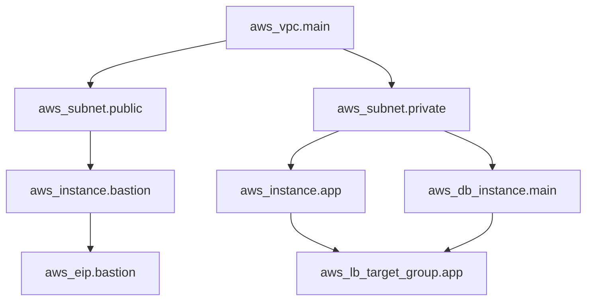

## 🔍 Section 15: Deep Understanding

### How Terraform Builds the Dependency Graph

When you run `terraform plan`, Terraform builds a **directed acyclic graph (DAG)** of resource dependencies:

```
Phase 1: walkCFG (Configuration Walker)
  ┌──────────────────────────────────────┐
  │  Parses all .tf files                │
  │  Identifies resource references:     │
  │    aws_instance.web → aws_subnet.pub │
  │    aws_subnet.pub → aws_vpc.main     │
  │  Builds initial graph                │
  └──────────────────────────────────────┘

Phase 2: walkApply (Execution)
  ┌──────────────────────────────────────┐
  │  Traverses graph in topological order│
  │  aws_vpc.main          → CREATE      │
  │  aws_subnet.pub        → CREATE      │
  │  aws_instance.web      → CREATE      │
  │  (Parallel where possible)           │
  └──────────────────────────────────────┘
```



Implicit dependencies come from **attribute references**:

```hcl
resource "aws_subnet" "public" {
  vpc_id = aws_vpc.main.id   # ← Creates implicit dependency
}

resource "aws_instance" "web" {
  subnet_id = aws_subnet.public[0].id  # ← Another dependency
}
```

Explicit dependencies via `depends_on`:

```hcl
resource "aws_s3_bucket" "data" {
  bucket = "my-bucket"
}

resource "aws_s3_bucket_object" "config" {
  bucket     = aws_s3_bucket.data.bucket
  key        = "config.json"
  content    = "{}"
  depends_on = [aws_s3_bucket.data]  # Explicit
}
```

### How the State File Maps to Real Infrastructure

```
Terraform State                    Real AWS
─────────────────                  ────────
aws_instance.web ─── instance_id ─> i-0abc1234
    ├── ami                        ami-0c55b159cbfafe1f0
    ├── instance_type              t3.micro
    ├── public_ip ────────────────> 54.123.45.67
    └── subnet_id ────────────────> subnet-0def5678
                                      ↑
aws_subnet.public ──── id ────────────┘
```

Terraform uses the state file to:

1. **Map logical names to real IDs** — So `aws_instance.web` knows it's `i-0abc1234`
2. **Read dependencies** — Knows subnet must exist before instance
3. **Detect drift** — If the actual instance type changed to `t3.small` but state says `t3.micro`, Terraform flags it

### The Provider Plugin Protocol (gRPC)

Terraform communicates with providers via **gRPC**. Each provider is a separate binary that Terraform starts as a child process:

```
┌─────────────────────────┐
│    Terraform Core        │
│  (HCL parser, graph,    │
│   plan/apply engine)    │
└────────┬────────────────┘
         │ gRPC (localhost)
         │
┌────────▼────────────────┐
│  Provider Plugin        │
│  (e.g., terraform-      │
│   provider-aws)         │
│                         │
│  - ValidateResourceConfig│
│  - PlanResourceChange   │
│  - ApplyResourceChange  │
│  - ReadResource         │
└─────────────────────────┘
```

The gRPC protocol defines these RPCs:

- `ValidateProviderConfig` — Check provider settings
- `ValidateResourceConfig` — Check resource syntax
- `PlanResourceChange` — What changes to make
- `ApplyResourceChange` — Execute changes (create/update/delete)
- `ReadResource` — Read current state (refresh)
- `ImportResourceState` — Import existing resources

### How Terraform Detects Drift

Drift is when real-world infrastructure differs from state. Terraform detects it via **refresh**:

```
1. terraform plan (or apply with -refresh)
2. For each resource in state, call provider's ReadResource
3. Provider makes API call (e.g., DescribeInstances)
4. Compare returned attributes with state attributes
5. If different → drift detected → plan shows change

Example:
  State:  instance_type = "t3.micro"
  Real:   instance_type = "m5.large"  ← Someone changed it manually!
  Plan:   ~ instance_type = "t3.micro" → (forces replacement?)
```

When you see `~` in a plan, it means "modify in-place." When you see `-/+`, it means "replace" (destroy and recreate).

### Lifecycle: Create-Before-Destroy vs Destroy-Before-Create

**Default (destroy-before-create)** for most resources:

```
Old instance ──DESTROY──▶ (gone) ──CREATE──▶ New instance
```

**create_before_destroy** (common for load balancers, DNS):

```
Old instance ──CREATE──▶ New instance ──SWITCH──▶ DESTROY old
```

Configure with lifecycle:

```hcl
resource "aws_instance" "web" {
  ami           = data.aws_ami.ubuntu.id
  instance_type = "t3.micro"

  lifecycle {
    create_before_destroy = true

    # Prevent accidental deletion
    prevent_destroy = true

    # Ignore specific attribute changes
    ignore_changes = [ami, user_data]

    # Hook for replacement
    precondition {
      condition     = var.instance_type != "t2.nano"
      error_message = "t2.nano is not allowed."
    }
  }
}
```

### How the Plan Is Computed

```
Inputs:
  .tf files  (desired state)
  .tfstate   (current state)
  Provider   (real infrastructure via API refresh)

Process:
  1. Parse .tf files → AST (Abstract Syntax Tree)
  2. Evaluate expressions → resolve variables, functions
  3. Build graph → order resources by dependency
  4. For each resource:
     a. Call provider.PlanResourceChange
     b. Provider computes the diff
     c. Returns planned state (what will change)
  5. Terraform compares planned state with current state
  6. Outputs plan summary:
       Plan: X to add, Y to change, Z to destroy

Plan Actions:
  +  Create (add)       — resource exists in config but not in state
  -  Destroy            — resource not in config but exists in state
  ~  Update in-place    — attributes changed
  -/+ Replace           — immutable attribute changed (e.g., AMI)
```

---


---

[← Previous](15-section-14-best-practices.md) | [↑ Index](index.md) | [Next →](17-section-16-hands-on-practices.md)
