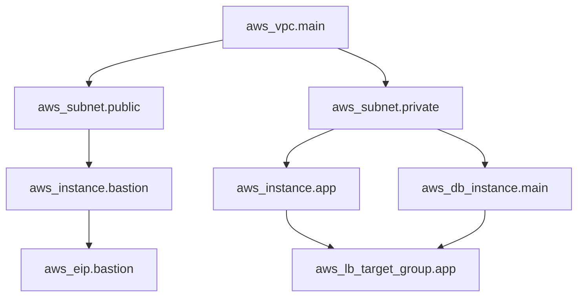

# 🐧 Linux System Administrator — Complete Course
## Part 51 of ∞: Infrastructure as Code — Terraform

---

> **Course Philosophy:** We use **Reverse Engineering Tactics** — we start from *what you already see*, then dig down into *why it works that way*. Instead of memorizing theory first, you understand by taking things apart.

---

## 🎯 What You Will Achieve in Part 51

By the end of this part, you will:

- Understand **Infrastructure as Code (IaC)** principles and why Terraform dominates the space
- Install and configure Terraform on Linux
- Write **HCL (HashiCorp Configuration Language)** with confidence
- Manage infrastructure through the full Terraform workflow: `init → plan → apply → destroy`
- Design reusable **modules**, manage **state** remotely, and implement **workspaces**
- Integrate **Terraform Cloud**, **CI/CD pipelines**, and **security scanning** into your workflow
- Build a **complete multi-tier infrastructure** (VPC + subnets + compute + database + load balancer)
- Pass the self-test and be ready for **Part 52: Kubernetes Administration**

---

## 🔍 Section 1: What Is Infrastructure as Code?

### The Old Way vs IaC

Before IaC, provisioning infrastructure looked like this:

```bash
# Manual: SSH into a server, run commands by hand
ssh admin@server
sudo apt update && sudo apt install -y nginx
sudo systemctl enable nginx
# ... pray you don't forget a step
```

Or at best, a shell script:

```bash
#!/bin/bash
# script.sh — fragile, not idempotent, no state tracking
aws ec2 run-instances --image-id ami-1234 --count 1 --instance-type t2.micro
aws s3 mb s3://my-bucket
```

Problems:
- **Not idempotent**: Running twice creates duplicate resources
- **No drift detection**: If someone manually changes the bucket policy, you never know
- **No dependency graph**: Scripts run top-to-bottom; you manage ordering yourself
- **State is tribal knowledge**: Who created what? Why? When?

### Declarative vs Imperative

| Approach | What You Write | How It Works | Example |
|----------|---------------|--------------|---------|
| **Imperative** | Step-by-step instructions | "Do A, then B, then C" | Bash, Ansible (playbooks), CloudFormation (sort of) |
| **Declarative** | Desired end state | "I want this; make it so" | Terraform, Pulumi, AWS CDK (sort of) |

Terraform is **declarative**: you write *what you want*, Terraform figures out *how to get there*.

```hcl
# Declarative: "I want an S3 bucket with this name"
resource "aws_s3_bucket" "data" {
  bucket = "my-company-data-lake-2026"
  tags = {
    Environment = "production"
  }
}
```

### Idempotency

An idempotent operation produces the same result no matter how many times you run it. Terraform is (mostly) idempotent:

```
$ terraform apply          # Creates the bucket
$ terraform apply          # No changes — bucket already exists
$ terraform apply          # Still no changes — idempotent
```

If someone deletes the bucket manually, `terraform apply` recreates it (drift correction).

### Desired State and Drift Detection

Terraform maintains a **state file** (`terraform.tfstate`) that maps your config to real infrastructure. When you run `terraform plan`, Terraform:

1. Reads the **current config** (your `.tf` files) → this is your **desired state**
2. Reads the **state file** → this is what Terraform *thinks* exists
3. Refreshes state against the **real provider API** → this is **actual state** (drift detection)
4. Computes the **diff** → this is the plan

```
┌──────────────┐     ┌──────────────┐     ┌──────────────┐
│  Desired      │     │   State      │     │  Real World  │
│  (.tf files)  │────▶│  (.tfstate)  │◀────│  (AWS/GCP)   │
└──────────────┘     └──────────────┘     └──────────────┘
                          │                      │
                          ▼                      ▼
                     ┌──────────────────────────┐
                     │    terraform plan         │
                     │  "3 to add, 1 to change" │
                     └──────────────────────────┘
```

### Benefits Over Manual/Scripted Provisioning

| Benefit | Why It Matters |
|---------|---------------|
| **Version control** | Your infrastructure is code — PRs, reviews, tags |
| **Reproducibility** | Same config → same infra, every time |
| **Self-documenting** | The `.tf` files *are* the documentation |
| **Collaboration** | Teams share state via remote backends |
| **Rollback** | `git revert` + `terraform apply` = infrastructure rollback |
| **Audit trail** | `git log` shows who changed what and why |
| **Cost tracking** | Tag resources, see what you're spending |

---

## 🔍 Section 2: Terraform Overview

### What Is Terraform?

Terraform is an open-source IaC tool by **HashiCorp**. It manages infrastructure across **2000+ providers** (AWS, GCP, Azure, Kubernetes, GitHub, Cloudflare, etc.).

Instead of learning 14 different CLIs (`aws`, `gcloud`, `az`, `kubectl`, `gh`...), you write one HCL config and run one CLI:

```
$ terraform apply
```

### HCL Syntax — A First Glance

HCL (HashiCorp Configuration Language) is the language Terraform uses. It's human-readable and structured in blocks:

```hcl
# Block type "resource" — creates infrastructure
resource "aws_instance" "web" {
  ami           = "ami-0c55b159cbfafe1f0"
  instance_type = "t3.micro"

  tags = {
    Name = "web-server"
  }
}
```

### The Terraform Workflow

```
    ┌─────────┐     ┌─────────┐     ┌─────────┐     ┌──────────┐
    │  init    │────▶│  plan   │────▶│  apply  │────▶│  destroy │
    └─────────┘     └─────────┘     └─────────┘     └──────────┘
         │              │              │                 │
         ▼              ▼              ▼                 ▼
    Download      Preview       Execute       Tear down
    providers     changes       changes       everything
```

1. **`terraform init`** — Downloads providers and modules, initializes backend
2. **`terraform plan`** — Shows what will be created/changed/destroyed
3. **`terraform apply`** — Executes the plan (with confirmation)
4. **`terraform destroy`** — Destroys all managed resources

### Providers

A **provider** is a plugin that translates Terraform's generic resource definitions into API calls for a specific platform.

```hcl
terraform {
  required_providers {
    aws = {
      source  = "hashicorp/aws"
      version = "~> 5.0"
    }
  }
}

provider "aws" {
  region = "us-east-1"
}
```

### The terraform Block and required_version

```hcl
terraform {
  required_version = ">= 1.5.0"

  required_providers {
    aws = {
      source  = "hashicorp/aws"
      version = "~> 5.0"
    }
  }
}
```

`required_version` enforces a minimum Terraform version. The `~>` operator means "allow patch updates but not minor version bumps" (e.g., `~> 5.0` allows 5.0.x but not 5.1).

---

## 🔍 Section 3: Installation

### Installing Terraform on Ubuntu/Debian

```bash
# Add HashiCorp's official repository
wget -O- https://apt.releases.hashicorp.com/gpg | sudo gpg --dearmor -o /usr/share/keyrings/hashicorp-archive-keyring.gpg
echo "deb [signed-by=/usr/share/keyrings/hashicorp-archive-keyring.gpg] https://apt.releases.hashicorp.com $(lsb_release -cs) main" | sudo tee /etc/apt/sources.list.d/hashicorp.list

# Install
sudo apt update && sudo apt install -y terraform

# Verify
terraform --version
```

### Shell Autocomplete

```bash
# Install autocomplete (adds to ~/.bashrc or ~/.zshrc)
terraform -install-autocomplete

# Reload shell
exec $SHELL
```

Now you can type `terraform p` + Tab and get `plan`, `providers`, `push`, etc.

### Configuration File: .terraformrc

Terraform's CLI configuration lives at `~/.terraformrc`:

```hcl
# ~/.terraformrc
provider_installation {
  filesystem_mirror {
    path    = "/usr/share/terraform/providers"
    include = ["hashicorp/*"]
  }
  direct {
    exclude = ["hashicorp/*"]
  }
}
```

### Provider Plugin Caching

Downloading provider plugins on every `init` is slow. Enable caching:

```bash
# Option 1: Environment variable
export TF_PLUGIN_CACHE_DIR="$HOME/.terraform.d/plugin-cache"

# Option 2: In .terraformrc
plugin_cache_dir = "$HOME/.terraform.d/plugin-cache"
```

```bash
# Create the cache directory
mkdir -p ~/.terraform.d/plugin-cache
```

Now `terraform init` reuses cached plugins instead of downloading them fresh.

---

## 🔍 Section 4: Core Concepts

### Resources

A **resource** is a piece of infrastructure (a VM, a DNS record, a database, etc.):

```hcl
resource "aws_instance" "web" {
  ami           = "ami-0c55b159cbfafe1f0"
  instance_type = "t3.micro"
}
```

The syntax is `resource "<type>" "<local_name>" { ... }`. The type (`aws_instance`) maps to the provider; the local name (`web`) is used to reference this resource elsewhere.

### Data Sources

A **data source** reads information from the provider without creating anything:

```hcl
# Look up the latest Ubuntu 22.04 AMI
data "aws_ami" "ubuntu" {
  most_recent = true
  owners      = ["099720109477"]  # Canonical

  filter {
    name   = "name"
    values = ["ubuntu/images/hvm-ssd/ubuntu-jammy-22.04-amd64-server-*"]
  }
}

# Use it in a resource
resource "aws_instance" "web" {
  ami           = data.aws_ami.ubuntu.id
  instance_type = "t3.micro"
}
```

Data sources reference with `data.<type>.<name>.attribute`.

### Providers

Providers handle the API communication. They can be configured with authentication, region, and other settings:

```hcl
provider "aws" {
  region = var.aws_region
  # Credentials come from env vars, ~/.aws/credentials, or IAM role
}
```

Multiple provider configurations (e.g., for different regions):

```hcl
provider "aws" {
  region = "us-east-1"
  alias  = "east"
}

provider "aws" {
  region = "eu-west-1"
  alias  = "west"
}

resource "aws_instance" "web_east" {
  provider = aws.east
  ami      = "ami-0abc123"
}

resource "aws_instance" "web_west" {
  provider = aws.west
  ami      = "ami-0def456"
}
```

### State

State is the bridge between config and reality:

```
/tree
├── main.tf          # Configuration (desired state)
├── variables.tf     # Input variables
├── outputs.tf       # Output values
└── terraform.tfstate  # Real-world mapping (AUTO-GENERATED, NEVER EDIT BY HAND)
```

### Variables

Input variables make configs reusable:

```hcl
# variables.tf
variable "instance_type" {
  description = "EC2 instance type"
  type        = string
  default     = "t3.micro"
}
```

### Outputs

Outputs expose information after apply:

```hcl
# outputs.tf
output "instance_ip" {
  value       = aws_instance.web.public_ip
  description = "The public IP of the web server"
}
```

### Locals

Locals are internal constants. They don't accept input from the caller:

```hcl
locals {
  name_prefix = "${var.project}-${var.environment}"
  common_tags = {
    Project     = var.project
    Environment = var.environment
    ManagedBy   = "Terraform"
  }
}
```

### Modules

Modules are reusable groups of resources. Every Terraform config is a module (the **root module**). Child modules are called from within:

```hcl
module "vpc" {
  source = "./modules/vpc"

  vpc_cidr = "10.0.0.0/16"
  env      = var.environment
}
```

---

## 🔍 Section 5: HCL Syntax Deep Dive

### Block Types

HCL has several block types:

```hcl
# Terraform settings
terraform { ... }

# Provider configuration
provider "aws" { ... }

# Resource declaration
resource "aws_s3_bucket" "data" { ... }

# Data source
data "aws_ami" "ubuntu" { ... }

# Variable declaration
variable "region" { ... }

# Output value
output "vpc_id" { ... }

# Local value
locals { ... }

# Module call
module "networking" { ... }
```

### Arguments and Attributes

Arguments set configuration; attributes export values:

```hcl
resource "aws_instance" "web" {
  ami           = "ami-123"        # Argument (you set this)
  instance_type = "t3.micro"       # Argument

  # Reference attribute from another resource
  subnet_id = aws_subnet.main.id   # Attribute reference
}
```

### Expressions

```hcl
# String interpolation
user_data = templatefile("${path.module}/userdata.sh", {
  hostname = var.hostname
})

# Arithmetic
volume_size = var.base_size * 2 + 10

# Conditional
instance_type = var.environment == "prod" ? "m5.large" : "t3.micro"

# Splat expressions
private_ips = aws_instance.web[*].private_ip
```

### Built-in Functions

```hcl
# lookup — safe map access
bucket_name = lookup(var.bucket_names, var.environment, "default-bucket")

# concat — merge lists
all_subnets = concat(var.public_subnets, var.private_subnets)

# toset — convert list to set (for for_each)
subnet_set = toset(var.subnet_names)

# file — read file contents
public_key = file("~/.ssh/id_rsa.pub")

# templatefile — render a template
rendered = templatefile("${path.module}/config.tpl", {
  server_name = var.server_name
})
```

### Conditionals

```hcl
# Ternary
is_prod = var.environment == "production" ? true : false

# count with conditional
resource "aws_instance" "bastion" {
  count = var.create_bastion ? 1 : 0
  # ...
}

# for_each with conditional
resource "aws_security_group_rule" "allow_http" {
  for_each = var.enable_http ? toset(["0.0.0.0/0"]) : toset([])
  # ...
}
```

### for_each and count

These metaparameters let you create multiple resources dynamically.

**count** — creates a numbered list:

```hcl
variable "subnet_cidrs" {
  type    = list(string)
  default = ["10.0.1.0/24", "10.0.2.0/24", "10.0.3.0/24"]
}

resource "aws_subnet" "public" {
  count      = length(var.subnet_cidrs)
  vpc_id     = aws_vpc.main.id
  cidr_block = var.subnet_cidrs[count.index]

  tags = {
    Name = "public-subnet-${count.index + 1}"
  }
}

# Access: aws_subnet.public[0], aws_subnet.public[1], ...
```

**for_each** — creates a map (keyed by unique identifier):

```hcl
variable "instances" {
  type = map(object({
    ami           = string
    instance_type = string
  }))
  default = {
    web  = { ami = "ami-abc", instance_type = "t3.micro" }
    app  = { ami = "ami-def", instance_type = "t3.small"  }
    db   = { ami = "ami-ghi", instance_type = "m5.large"  }
  }
}

resource "aws_instance" "servers" {
  for_each = var.instances

  ami           = each.value.ami
  instance_type = each.value.instance_type

  tags = {
    Name = "server-${each.key}"
  }
}

# Access: aws_instance.servers["web"], aws_instance.servers["app"], ...
```

Use **for_each** when you need stable, meaningful keys. Use **count** when you need a simple numbered list.

---

## 🔍 Section 6: Variables and Outputs

### Input Variables

```hcl
# variables.tf — full spec
variable "environment" {
  description = "Deployment environment"
  type        = string
  default     = "development"

  validation {
    condition     = contains(["development", "staging", "production"], var.environment)
    error_message = "Environment must be one of: development, staging, production."
  }
}

variable "instance_type" {
  description = "EC2 instance type"
  type        = string
}

variable "sensitive_token" {
  description = "API token"
  type        = string
  sensitive   = true  # Hidden from CLI output
}

variable "tags" {
  description = "Resource tags"
  type        = map(string)
  default = {
    ManagedBy = "Terraform"
  }
}

variable "subnets" {
  description = "Subnet configuration"
  type = map(object({
    cidr_block = string
    az         = string
  }))
}
```

### Variable Types

| Type | Example | Description |
|------|---------|-------------|
| `string` | `"t3.micro"` | A string value |
| `number` | `42` | A number |
| `bool` | `true` | Boolean |
| `list(type)` | `["a", "b"]` | Ordered list |
| `map(type)` | `{key = "val"}` | Key-value map |
| `set(type)` | `toset(["a", "b"])` | Unordered unique set |
| `object({...})` | `{name = string, age = number}` | Structured record |
| `tuple([...])` | `["a", 1, true]` | Positional sequence |
| `any` | anything | Accept any type |

### Variable Precedence (highest to lowest)

```
 1. -var or -var-file CLI flags        — Highest
 2. *.auto.tfvars or *.auto.tfvars.json — Auto-loaded
 3. terraform.tfvars or terraform.tfvars.json — Default var file
 4. Environment variables (TF_VAR_*)   — env prefix
 5. default in variable block          — Lowest
```

```bash
# Order of precedence examples:
$ export TF_VAR_environment=staging          # #4
$ terraform apply -var="environment=prod"    # #1 (overrides all)
```

### terraform.tfvars Example

```hcl
# terraform.tfvars
environment      = "production"
instance_type    = "m5.large"
sensitive_token  = "sk-abc123..."
enable_monitoring = true
```

### Output Values

```hcl
# outputs.tf
output "vpc_id" {
  value       = aws_vpc.main.id
  description = "The VPC ID"
}

output "instance_ips" {
  value       = aws_instance.web[*].public_ip
  description = "Public IPs of web instances"
}

output "database_endpoint" {
  value       = aws_db_instance.main.endpoint
  sensitive   = true  # Don't show in plain text
  description = "Database connection endpoint"
}
```

View outputs after apply:

```bash
terraform output
terraform output vpc_id
terraform output -json instance_ips
```

---

## 🔍 Section 7: State Management

### Why State Matters

Terraform uses **state** to:

1. **Map config to real infrastructure** — knows `aws_instance.web` is `i-0abcd1234`
2. **Track metadata** — dependencies, attributes, sensitive values
3. **Improve performance** — can compare state vs config without API calls
4. **Enable collaboration** — remote state allows teams to work together

### Local State (Default)

```hcl
# No backend config → local state
# Creates: terraform.tfstate in the current directory
```

Problems with local state:
- Lost if your machine dies
- No locking (two people running apply at the same time = corrupted state)
- Not shared with a team

### Remote State

```hcl
# backend.tf
terraform {
  backend "s3" {
    bucket         = "my-company-terraform-state"
    key            = "production/network/terraform.tfstate"
    region         = "us-east-1"
    dynamodb_table = "terraform-state-lock"
    encrypt        = true
  }
}
```

### State Locking with DynamoDB

Prevents concurrent operations:

```bash
# Create the DynamoDB table (one-time)
resource "aws_dynamodb_table" "terraform_lock" {
  name         = "terraform-state-lock"
  billing_mode = "PAY_PER_REQUEST"
  hash_key     = "LockID"

  attribute {
    name = "LockID"
    type = "S"
  }
}
```

When you run `terraform apply`, Terraform acquires a lock in DynamoDB. Another user running apply simultaneously gets:

```
Error: Error acquiring the state lock

Lock Info:
  ID:         abc123
  Path:       my-company-terraform-state/production/network/terraform.tfstate
  Operation:  apply
  Who:        tim@dev-machine
  Version:    1.5.0
  Created:    2026-06-24 14:00:00
  Info:       https://docs.opensource.microsoft.com/

Terraform acquires a lock during operations. Use -lock=false to override.
```

Force unlock (use carefully):

```bash
terraform force-unlock <LOCK_ID>
```

### terraform state Commands

```bash
# List all resources in state
terraform state list

# Show details of one resource
terraform state show aws_instance.web

# Move a resource (rename it in state)
terraform state mv aws_instance.web aws_instance.frontend

# Remove a resource from state (without destroying it)
terraform state rm aws_s3_bucket.data

# Pull state to stdout
terraform state pull > backup.tfstate

# Push state file (DANGEROUS)
terraform state push backup.tfstate

# Replace provider in state (after provider rename)
terraform state replace-provider hashicorp/aws registry.example.com/awesomecorp/aws
```

### State File Format

State is JSON. Never edit it by hand:

```json
{
  "version": 4,
  "terraform_version": "1.5.0",
  "resources": [
    {
      "module": "root",
      "mode": "managed",
      "type": "aws_instance",
      "name": "web",
      "provider": "provider[\"registry.terraform.io/hashicorp/aws\"]",
      "instances": [
        {
          "schema_version": 1,
          "attributes": {
            "id": "i-0abcd1234",
            "ami": "ami-0c55b159cbfafe1f0",
            "instance_type": "t3.micro",
            "public_ip": "54.123.45.67"
          }
        }
      ]
    }
  ]
}
```

### Sensitive Data in State

State files can contain **plaintext secrets** (passwords, keys, tokens). Protect them:

1. **Enable encryption** on the backend (S3 SSE-S3/SSE-KMS, GCS encryption)
2. **Restrict access** with IAM roles and bucket policies
3. **Enable audit logging** (S3 access logs, CloudTrail)
4. **Use `sensitive = true`** in variables/outputs (still in state, but hidden from CLI)
5. **Use a secrets manager** for true secrets (AWS Secrets Manager, Vault)

---

## 🔍 Section 8: Remote Backends

### Comparison of Remote Backends

| Backend | Locking | Encryption | Best For |
|---------|---------|------------|----------|
| **S3 + DynamoDB** | Yes (DDB) | SSE-S3/KMS | AWS shops |
| **GCS** | Yes (cloud storage object) | AES256/CMEK | GCP shops |
| **AzureRM** | Yes (Blob Storage lease) | SSE | Azure shops |
| **Terraform Cloud** | Yes | Yes | Multi-cloud, teams |
| **Consul** | Yes (session) | Optional | Self-hosted |
| **etcd** | Yes | No | Self-hosted, Kubernetes |

### S3 + DynamoDB (Full Example)

```hcl
# backend.tf
terraform {
  backend "s3" {
    bucket         = "terraform-state-company-2026"
    key            = "${var.environment}/terraform.tfstate"
    region         = "us-east-1"
    dynamodb_table = "terraform-locks"
    encrypt        = true
    kms_key_id     = "alias/terraform-state-key"
  }
}
```

Bootstrap script to create the backend resources:

```hcl
# bootstrap/main.tf — run once, then migrate state
provider "aws" {
  region = "us-east-1"
}

resource "aws_s3_bucket" "terraform_state" {
  bucket = "terraform-state-company-2026"
}

resource "aws_s3_bucket_versioning" "terraform_state" {
  bucket = aws_s3_bucket.terraform_state.id
  versioning_configuration {
    status = "Enabled"
  }
}

resource "aws_s3_bucket_server_side_encryption_configuration" "terraform_state" {
  bucket = aws_s3_bucket.terraform_state.id

  rule {
    apply_server_side_encryption_by_default {
      sse_algorithm = "AES256"
    }
  }
}

resource "aws_s3_bucket_public_access_block" "terraform_state" {
  bucket = aws_s3_bucket.terraform_state.id

  block_public_acls       = true
  block_public_policy     = true
  ignore_public_acls      = true
  restrict_public_buckets = true
}

resource "aws_dynamodb_table" "terraform_locks" {
  name         = "terraform-locks"
  billing_mode = "PAY_PER_REQUEST"
  hash_key     = "LockID"

  attribute {
    name = "LockID"
    type = "S"
  }
}
```

### Partial Configuration

Don't hardcode everything in the backend block. Use partial config:

```hcl
# backend.tf — partial config (values passed at init)
terraform {
  backend "s3" {
    # bucket, key, region passed at init time
  }
}
```

```bash
# Pass the rest via init
terraform init \
  -backend-config="bucket=terraform-state-company-2026" \
  -backend-config="key=prod/network.tfstate" \
  -backend-config="region=us-east-1" \
  -backend-config="dynamodb_table=terraform-locks"
```

### Migration

To migrate from local to remote state:

```bash
# 1. Add backend block to config
# 2. Run init with -reconfigure (destructive) or -migrate (non-destructive)
terraform init -migrate

# Terraform copies local state to the remote backend
# Then asks if you want to copy existing state:
# Do you want to copy existing state to the new backend?
#   Enter a value: yes
```

---

## 🔍 Section 9: Modules

### Module Structure

A module is a directory with `.tf` files. Convention:

```
modules/
└── vpc/
    ├── main.tf          # Resources
    ├── variables.tf     # Input variables
    └── outputs.tf       # Output values
```

### Using a Module from the Registry

```hcl
module "vpc" {
  source  = "terraform-aws-modules/vpc/aws"
  version = "5.0.0"

  name = "my-vpc"
  cidr = "10.0.0.0/16"

  azs             = ["us-east-1a", "us-east-1b"]
  private_subnets = ["10.0.1.0/24", "10.0.2.0/24"]
  public_subnets  = ["10.0.101.0/24", "10.0.102.0/24"]

  enable_nat_gateway = true
  enable_vpn_gateway = false

  tags = {
    Environment = var.environment
  }
}
```

### Writing a Local Module

**modules/vpc/main.tf**:

```hcl
resource "aws_vpc" "this" {
  cidr_block           = var.vpc_cidr
  enable_dns_hostnames = true
  enable_dns_support   = true

  tags = {
    Name        = "${var.env}-vpc"
    Environment = var.env
  }
}

resource "aws_subnet" "public" {
  count             = length(var.public_subnet_cidrs)
  vpc_id            = aws_vpc.this.id
  cidr_block        = var.public_subnet_cidrs[count.index]
  availability_zone = var.availability_zones[count.index]

  map_public_ip_on_launch = true

  tags = {
    Name        = "${var.env}-public-subnet-${count.index + 1}"
    Environment = var.env
    Type        = "public"
  }
}

resource "aws_subnet" "private" {
  count             = length(var.private_subnet_cidrs)
  vpc_id            = aws_vpc.this.id
  cidr_block        = var.private_subnet_cidrs[count.index]
  availability_zone = var.availability_zones[count.index]

  tags = {
    Name        = "${var.env}-private-subnet-${count.index + 1}"
    Environment = var.env
    Type        = "private"
  }
}
```

**modules/vpc/variables.tf**:

```hcl
variable "vpc_cidr" {
  description = "CIDR block for the VPC"
  type        = string
}

variable "env" {
  description = "Environment name"
  type        = string
}

variable "public_subnet_cidrs" {
  description = "CIDR blocks for public subnets"
  type        = list(string)
}

variable "private_subnet_cidrs" {
  description = "CIDR blocks for private subnets"
  type        = list(string)
}

variable "availability_zones" {
  description = "List of availability zones"
  type        = list(string)
}
```

**modules/vpc/outputs.tf**:

```hcl
output "vpc_id" {
  value = aws_vpc.this.id
}

output "public_subnet_ids" {
  value = aws_subnet.public[*].id
}

output "private_subnet_ids" {
  value = aws_subnet.private[*].id
}
```

### Calling a Module from Root

```hcl
# root main.tf
module "vpc" {
  source = "./modules/vpc"

  vpc_cidr             = "10.0.0.0/16"
  env                  = var.environment
  public_subnet_cidrs  = ["10.0.1.0/24", "10.0.2.0/24"]
  private_subnet_cidrs = ["10.0.10.0/24", "10.0.20.0/24"]
  availability_zones   = ["us-east-1a", "us-east-1b"]
}

resource "aws_instance" "web" {
  ami           = data.aws_ami.ubuntu.id
  instance_type = "t3.micro"
  subnet_id     = module.vpc.public_subnet_ids[0]
}
```

### Module Sources

```hcl
# Local filesystem
module "local" {
  source = "./modules/networking"
}

# Terraform Registry
module "registry" {
  source  = "terraform-aws-modules/vpc/aws"
  version = "5.0.0"
}

# GitHub
module "github" {
  source = "github.com/org/repo//path/to/module?ref=v1.0.0"
}

# Generic Git
module "git" {
  source = "git::https://example.com/vpc-module.git?ref=main"
}

# S3 (compressed archive)
module "s3" {
  source = "s3::https://s3-eu-west-1.amazonaws.com/my-bucket/modules/vpc.zip"
}

# HTTP (compressed archive)
module "http" {
  source = "https://example.com/modules/vpc.zip"
}

# Terraform Cloud private registry
module "private" {
  source  = "app.terraform.io/my-org/vpc/aws"
  version = "1.0.0"
}
```

### Version Constraints

```hcl
module "vpc" {
  source  = "terraform-aws-modules/vpc/aws"
  version = ">= 4.0.0, < 6.0.0"

  # or just:
  version = "~> 5.0"
  # ~> 5.0 → >= 5.0, < 5.1
  # ~> 5.4 → >= 5.4, < 6.0
}
```

---

## 🔍 Section 10: Workspaces

### What Are Workspaces?

Workspaces allow you to manage multiple environments (dev, staging, prod) with the **same configuration** but **separate state files**.

```
Local state:
  terraform.tfstate            ← "default" workspace
  terraform.tfstate.d/dev/     ← "dev" workspace
  terraform.tfstate.d/prod/    ← "prod" workspace

S3 remote state:
  s3://bucket/env:/default/terraform.tfstate
  s3://bucket/env:/dev/terraform.tfstate
  s3://bucket/env:/prod/terraform.tfstate
```

### Workspace Commands

```bash
# List workspaces
terraform workspace list
  * default

# Create a new workspace (and switch to it)
terraform workspace new dev
terraform workspace new staging
terraform workspace new prod

# Switch between workspaces
terraform workspace select staging
terraform workspace select default

# Show current workspace
terraform workspace show
# → staging
```

### Using terraform.workspace in Config

You can reference the current workspace name inside your config:

```hcl
locals {
  # Use workspace name in resource naming
  env_name = terraform.workspace == "default" ? "dev" : terraform.workspace
}

resource "aws_s3_bucket" "data" {
  bucket = "myapp-data-${local.env_name}"

  tags = {
    Name        = "myapp-data-${local.env_name}"
    Environment = local.env_name
  }
}
```

### Variable Values Per Workspace

```hcl
# terraform.tfvars
instance_type_map = {
  dev     = "t3.micro"
  staging = "t3.small"
  prod    = "m5.large"
}

instance_count_map = {
  dev     = 1
  staging = 2
  prod    = 3
}
```

```hcl
# main.tf
variable "instance_type_map" {
  type = map(string)
}

variable "instance_count_map" {
  type = map(number)
}

locals {
  env = terraform.workspace == "default" ? "dev" : terraform.workspace
}

resource "aws_instance" "web" {
  count         = lookup(local.instance_count_map, local.env, 1)
  ami           = data.aws_ami.ubuntu.id
  instance_type = lookup(local.instance_type_map, local.env, "t3.micro")

  tags = {
    Name        = "web-${local.env}-${count.index + 1}"
    Environment = local.env
  }
}
```

### Environment Separation Pattern

```bash
# Dev
terraform workspace new dev
terraform apply

# Staging
terraform workspace new staging
terraform apply

# Prod
terraform workspace new prod
terraform apply

# Verify separation
terraform workspace select dev
terraform state list
# → only dev resources

terraform workspace select prod
terraform state list
# → only prod resources
```

---

## 🔍 Section 11: Provisioners

### What Are Provisioners?

Provisioners run scripts on resources after creation:

- **`file`** — Upload files to the resource
- **`remote-exec`** — Run commands on the resource (via SSH/WinRM)
- **`local-exec`** — Run commands on the machine running Terraform

### file Provisioner

```hcl
resource "aws_instance" "web" {
  ami           = data.aws_ami.ubuntu.id
  instance_type = "t3.micro"

  provisioner "file" {
    source      = "${path.module}/scripts/setup.sh"
    destination = "/home/ubuntu/setup.sh"

    connection {
      type        = "ssh"
      host        = self.public_ip
      user        = "ubuntu"
      private_key = file("~/.ssh/id_rsa")
    }
  }
}
```

### remote-exec Provisioner

```hcl
resource "aws_instance" "web" {
  ami           = data.aws_ami.ubuntu.id
  instance_type = "t3.micro"

  provisioner "remote-exec" {
    inline = [
      "sudo apt update -y",
      "sudo apt install -y nginx",
      "sudo systemctl enable nginx",
      "sudo systemctl start nginx",
    ]

    connection {
      type        = "ssh"
      host        = self.public_ip
      user        = "ubuntu"
      private_key = file("~/.ssh/id_rsa")
    }
  }
}
```

### local-exec Provisioner

```hcl
resource "aws_instance" "web" {
  ami           = data.aws_ami.ubuntu.id
  instance_type = "t3.micro"
}

resource "null_resource" "post_deploy" {
  depends_on = [aws_instance.web]

  provisioner "local-exec" {
    command = <<EOF
      echo "Instance ${aws_instance.web.id} created at ${aws_instance.web.public_ip}" >> /var/log/deployments.log
      curl -X POST https://hooks.slack.com/services/T... \
        -H 'Content-Type: application/json' \
        -d '{"text":"EC2 instance ${aws_instance.web.id} deployed!"}'
    EOF
  }
}
```

### Why Provisioners Are a Last Resort

HashiCorp explicitly recommends against provisioners. Why?

1. **Not idempotent** — Running `apply` again doesn't re-run provisioners (unless you taint the resource)
2. **Stateful** — Provisioners run on create, not on update; if you change the script, Terraform won't re-run it
3. **Slow** — SSH/WinRM connections are slow and unreliable
4. **Hard to debug** — Errors are hard to reproduce
5. **Config management exists** — Use **Ansible, Chef, Puppet, Salt** for post-deployment config, or better yet, use **userdata/cloud-init**

**Better approach: cloud-init userdata**:

```hcl
resource "aws_instance" "web" {
  ami           = data.aws_ami.ubuntu.id
  instance_type = "t3.micro"

  user_data = <<-EOF
    #!/bin/bash
    apt update -y
    apt install -y nginx
    systemctl enable nginx
    systemctl start nginx
  EOF
}
```

**Even better: packer image + immutable infrastructure**:

```hcl
# Pre-bake the AMI with Packer, then just reference it
resource "aws_instance" "web" {
  ami           = data.aws_ami.my_app_ami.id
  instance_type = "t3.micro"
  # No provisioners needed — everything is in the AMI
}
```

When you absolutely must use a provisioner, use `on_failure` and `when`:

```hcl
provisioner "remote-exec" {
  when        = destroy         # Run on destroy instead of create
  on_failure  = continue        # Don't fail if the script fails
  inline = ["sudo shutdown -h now"]
}
```

---

## 🔍 Section 12: Terraform Cloud / Enterprise

### Terraform Cloud Overview

Terraform Cloud (TFC) adds collaboration features on top of open-source Terraform:

| Feature | Open Source | TFC Free | TFC Team | TFC Enterprise |
|---------|-------------|----------|----------|----------------|
| Local runs | ✅ | ✅ | ✅ | ✅ |
| Remote runs | ❌ | ✅ | ✅ | ✅ |
| State storage | Manual S3 | ✅ Managed | ✅ Managed | ✅ Managed |
| State locking | Manual DDB | ✅ Built-in | ✅ Built-in | ✅ Built-in |
| VCS integration | ❌ | ✅ | ✅ | ✅ |
| Sentinel policies | ❌ | ❌ | ✅ | ✅ |
| Private module registry | ❌ | ❌ | ✅ | ✅ |
| Run tasks | ❌ | ❌ | ✅ | ✅ |
| Audit logging | ❌ | ❌ | ❌ | ✅ |
| SAML/SSO | ❌ | ❌ | ❌ | ✅ |

### Remote Runs Configuration

```hcl
# terraform.tf — use TFC as backend
terraform {
  cloud {
    organization = "my-company"

    workspaces {
      name = "infra-production"
    }
  }
}
```

Or use tags for dynamic workspaces:

```hcl
terraform {
  cloud {
    organization = "my-company"

    workspaces {
      tags = ["env:prod", "app:web"]
    }
  }
}
```

### VCS Integration

Terraform Cloud integrates with GitHub, GitLab, Bitbucket:

```
Git Push → Webhook → TFC Triggers Run → terraform plan → Comment on PR
                                                   ↓
                                             Manual Apply (or auto-apply)
```

Workflow:

1. Developer opens a PR modifying `main.tf`
2. Terraform Cloud automatically runs `terraform plan`
3. The plan is posted as a PR comment
4. A reviewer approves and merges
5. Terraform Cloud runs `terraform apply`

### Sentinel Policies

Sentinel is a policy-as-code framework. Policies run before the apply:

```hcl
# policies/enforce-tags.sentinel
import "tfplan/v2" as tfplan

main = rule {
  all tfplan.resource_changes as _, rc {
    rc.mode is "managed" implies
      all rc.change.after.tags else {} as key, _ {
        key in ["Environment", "Owner", "CostCenter"]
      }
  }
}
```

### Run Tasks

TFC can call external services during runs:

```
TFC Run → HTTP Call → External Service → Result → TFC Continues or Fails
```

Common run tasks:
- **tfsec** / **checkov** — Security scanning
- **infracost** — Cost estimation
- **aqua** — Container security
- Custom compliance checks

### Private Module Registry

Store reusable modules internally:

```bash
# Publish a module
terraform login  # Authenticate with TFC
git tag v1.0.0
git push --tags

# Then TFC auto-imports it to the private registry
```

```hcl
# Use from private registry
module "vpc" {
  source  = "app.terraform.io/my-company/vpc/aws"
  version = "1.0.0"
}
```

---

## 🔍 Section 13: Testing and CI

### Validation

```bash
# Basic syntax check
terraform validate

# Format check
terraform fmt -check -recursive

# Plan (dry run)
terraform plan -out=tfplan
```

### Static Analysis Tools

**tflint** — Terraform-specific linter:

```bash
# Install
curl -s https://raw.githubusercontent.com/terraform-linters/tflint/master/install_linux.sh | bash

# Run
tflint --init
tflint --recursive
```

```hcl
# .tflint.hcl
plugin "aws" {
  enabled = true
  version = "0.24.0"
  source  = "github.com/terraform-linters/tflint-ruleset-aws"
}

rule "aws_instance_previous_type" {
  enabled = true
}

rule "aws_resource_missing_tags" {
  enabled = true
  tags    = ["Environment", "Name", "Owner"]
}
```

**checkov** — Security scanner (supports Terraform, CloudFormation, K8s):

```bash
# Install
pip install checkov

# Run
checkov -d .
```

```bash
# Scan results example
terraform scan results:

Passed checks: 15, Failed checks: 2, Skipped checks: 0

Check: CKV_AWS_18: "Ensure the S3 bucket has access logging enabled"
        FAILED for resource: aws_s3_bucket.data
        File: main.tf:15-25

Check: CKV_AWS_21: "Ensure all data stored in the S3 bucket is securely encrypted"
        FAILED for resource: aws_s3_bucket.data
        File: main.tf:15-25
```

**terrascan** — Static code analyzer:

```bash
# Install
curl -L "$(curl -s https://api.github.com/repos/accurics/terrascan/releases/latest | grep -o -E "https://.+?_Linux_x86_64.tar.gz")" -o terrascan.tar.gz
tar -xzf terrascan.tar.gz && sudo mv terrascan /usr/local/bin/

# Run
terrascan scan -d .
```

### CI Pipeline Integration (GitHub Actions)

```yaml
# .github/workflows/terraform.yml
name: Terraform

on:
  pull_request:
    branches: [main]

jobs:
  terraform:
    runs-on: ubuntu-latest
    defaults:
      run:
        working-directory: ./infra

    steps:
      - uses: actions/checkout@v3

      - name: Setup Terraform
        uses: hashicorp/setup-terraform@v2
        with:
          terraform_version: 1.5.0

      - name: Terraform Format
        run: terraform fmt -check -recursive

      - name: Terraform Init
        run: terraform init

      - name: tflint
        uses: terraform-linters/setup-tflint@v3
        with:
          tflint_version: v0.47.0

      - run: tflint --recursive

      - name: Checkov
        uses: bridgecrewio/checkov-action@v12
        with:
          directory: infra
          framework: terraform

      - name: Terraform Plan
        run: terraform plan -out=tfplan

      - name: Upload Plan
        uses: actions/upload-artifact@v3
        with:
          name: tfplan
          path: infra/tfplan
```

### Terratest — Integration Testing

```go
// test/terraform_test.go
package test

import (
  "testing"
  "github.com/gruntwork-io/terratest/modules/terraform"
  "github.com/stretchr/testify/assert"
)

func TestTerraformAwsInstance(t *testing.T) {
  terraformOptions := &terraform.Options{
    TerraformDir: "../examples/instance",
    Vars: map[string]interface{}{
      "instance_type": "t3.micro",
    },
  }

  defer terraform.Destroy(t, terraformOptions)
  terraform.InitAndApply(t, terraformOptions)

  instanceID := terraform.Output(t, terraformOptions, "instance_id")
  assert.Contains(t, instanceID, "i-")
}
```

```bash
go test -v -timeout 30m
```

---

## 🔍 Section 14: Best Practices

### File Layout

```
infra/
├── environments/
│   ├── dev/
│   │   ├── main.tf
│   │   ├── variables.tf
│   │   ├── outputs.tf
│   │   └── terraform.tfvars
│   ├── staging/
│   │   └── ...
│   └── prod/
│       └── ...
├── modules/
│   ├── vpc/
│   │   ├── main.tf
│   │   ├── variables.tf
│   │   └── outputs.tf
│   ├── compute/
│   │   └── ...
│   └── database/
│       └── ...
├── .tflint.hcl
├── .terraform.lock.hcl
└── README.md
```

### Naming Conventions

```hcl
# Resources
resource "aws_instance" "web" {}         # Short, meaningful
resource "aws_db_instance" "primary" {}  # Role-based, not "db-xyz-123"

# Variables
variable "instance_type" {}              # snake_case
variable "enable_monitoring" {}          # Boolean prefixed with enable/disable

# Locals
locals {
  name_prefix = "..."                     # Descriptive
  common_tags = { ... }                   # Reusable
}

# Outputs
output "vpc_id" {}                        # Resource_attribute pattern
output "public_subnet_ids" {}             # Plural for lists
```

### Tagging Strategy

```hcl
locals {
  required_tags = {
    Name        = var.resource_name
    Environment = var.environment
    Owner       = var.owner
    CostCenter  = var.cost_center
    ManagedBy   = "Terraform"
    CreatedAt   = timestamp()
  }
}

resource "aws_instance" "web" {
  # ...
  tags = local.required_tags
}
```

### Module Design Principles

1. **Cohesion** — A module should do one thing well (VPC module makes VPCs, not VPCs + databases)
2. **Abstraction** — Hide complexity, expose only what's configurable
3. **Version pinning** — Always pin module versions
4. **Documentation** — Every variable and output needs a `description`
5. **No hard-coded defaults** — Let the caller decide
6. **Input validation** — Validate inputs early
7. **Output what matters** — Expose useful attributes for callers

```hcl
# Good module signature
module "vpc" {
  source  = "terraform-aws-modules/vpc/aws"
  version = "5.0.0"

  name = "my-vpc"
  cidr = "10.0.0.0/16"
  # ... explicit configuration
}

# Bad — too much magic
module "magic" {
  source = "./modules/all-in-one"
  # What does this do? Who knows!
}
```

### Version Locking

Always lock provider versions:

```hcl
terraform {
  required_version = ">= 1.5.0"
  required_providers {
    aws = {
      source  = "hashicorp/aws"
      version = "~> 5.0"
    }
    random = {
      source  = "hashicorp/random"
      version = ">= 3.0"
    }
  }
}
```

### .terraform.lock.hcl

The lock file pins the exact provider version. Commit it:

```bash
# The lock file is auto-generated by `terraform init`
# Commit it to track exact provider versions
git add .terraform.lock.hcl
```

```hcl
# This file is maintained automatically by "terraform init".
# Manual edits may be incorrect.

provider "registry.terraform.io/hashicorp/aws" {
  version     = "5.17.0"
  constraints = "~> 5.17.0"
  hashes = [
    "h1:rMqW+9p4RjLxG4FHlg3S8tMIFBYbZ+X9o6+4JE2118=",
    "zh:14d8bb78c9a20a3abda261f0ed78b2b03c3aa0a8cdb1f26e6e546f61e355b85",
    # ...
  ]
}
```

---

## 🔍 Section 15: Deep Understanding

### How Terraform Builds the Dependency Graph

When you run `terraform plan`, Terraform builds a **directed acyclic graph (DAG)** of resource dependencies:

```
Phase 1: walkCFG (Configuration Walker)
  ┌──────────────────────────────────────┐
  │  Parses all .tf files                │
  │  Identifies resource references:     │
  │    aws_instance.web → aws_subnet.pub │
  │    aws_subnet.pub → aws_vpc.main     │
  │  Builds initial graph                │
  └──────────────────────────────────────┘

Phase 2: walkApply (Execution)
  ┌──────────────────────────────────────┐
  │  Traverses graph in topological order│
  │  aws_vpc.main          → CREATE      │
  │  aws_subnet.pub        → CREATE      │
  │  aws_instance.web      → CREATE      │
  │  (Parallel where possible)           │
  └──────────────────────────────────────┘
```



Implicit dependencies come from **attribute references**:

```hcl
resource "aws_subnet" "public" {
  vpc_id = aws_vpc.main.id   # ← Creates implicit dependency
}

resource "aws_instance" "web" {
  subnet_id = aws_subnet.public[0].id  # ← Another dependency
}
```

Explicit dependencies via `depends_on`:

```hcl
resource "aws_s3_bucket" "data" {
  bucket = "my-bucket"
}

resource "aws_s3_bucket_object" "config" {
  bucket     = aws_s3_bucket.data.bucket
  key        = "config.json"
  content    = "{}"
  depends_on = [aws_s3_bucket.data]  # Explicit
}
```

### How the State File Maps to Real Infrastructure

```
Terraform State                    Real AWS
─────────────────                  ────────
aws_instance.web ─── instance_id ─> i-0abc1234
    ├── ami                        ami-0c55b159cbfafe1f0
    ├── instance_type              t3.micro
    ├── public_ip ────────────────> 54.123.45.67
    └── subnet_id ────────────────> subnet-0def5678
                                      ↑
aws_subnet.public ──── id ────────────┘
```

Terraform uses the state file to:

1. **Map logical names to real IDs** — So `aws_instance.web` knows it's `i-0abc1234`
2. **Read dependencies** — Knows subnet must exist before instance
3. **Detect drift** — If the actual instance type changed to `t3.small` but state says `t3.micro`, Terraform flags it

### The Provider Plugin Protocol (gRPC)

Terraform communicates with providers via **gRPC**. Each provider is a separate binary that Terraform starts as a child process:

```
┌─────────────────────────┐
│    Terraform Core        │
│  (HCL parser, graph,    │
│   plan/apply engine)    │
└────────┬────────────────┘
         │ gRPC (localhost)
         │
┌────────▼────────────────┐
│  Provider Plugin        │
│  (e.g., terraform-      │
│   provider-aws)         │
│                         │
│  - ValidateResourceConfig│
│  - PlanResourceChange   │
│  - ApplyResourceChange  │
│  - ReadResource         │
└─────────────────────────┘
```

The gRPC protocol defines these RPCs:

- `ValidateProviderConfig` — Check provider settings
- `ValidateResourceConfig` — Check resource syntax
- `PlanResourceChange` — What changes to make
- `ApplyResourceChange` — Execute changes (create/update/delete)
- `ReadResource` — Read current state (refresh)
- `ImportResourceState` — Import existing resources

### How Terraform Detects Drift

Drift is when real-world infrastructure differs from state. Terraform detects it via **refresh**:

```
1. terraform plan (or apply with -refresh)
2. For each resource in state, call provider's ReadResource
3. Provider makes API call (e.g., DescribeInstances)
4. Compare returned attributes with state attributes
5. If different → drift detected → plan shows change

Example:
  State:  instance_type = "t3.micro"
  Real:   instance_type = "m5.large"  ← Someone changed it manually!
  Plan:   ~ instance_type = "t3.micro" → (forces replacement?)
```

When you see `~` in a plan, it means "modify in-place." When you see `-/+`, it means "replace" (destroy and recreate).

### Lifecycle: Create-Before-Destroy vs Destroy-Before-Create

**Default (destroy-before-create)** for most resources:

```
Old instance ──DESTROY──▶ (gone) ──CREATE──▶ New instance
```

**create_before_destroy** (common for load balancers, DNS):

```
Old instance ──CREATE──▶ New instance ──SWITCH──▶ DESTROY old
```

Configure with lifecycle:

```hcl
resource "aws_instance" "web" {
  ami           = data.aws_ami.ubuntu.id
  instance_type = "t3.micro"

  lifecycle {
    create_before_destroy = true

    # Prevent accidental deletion
    prevent_destroy = true

    # Ignore specific attribute changes
    ignore_changes = [ami, user_data]

    # Hook for replacement
    precondition {
      condition     = var.instance_type != "t2.nano"
      error_message = "t2.nano is not allowed."
    }
  }
}
```

### How the Plan Is Computed

```
Inputs:
  .tf files  (desired state)
  .tfstate   (current state)
  Provider   (real infrastructure via API refresh)

Process:
  1. Parse .tf files → AST (Abstract Syntax Tree)
  2. Evaluate expressions → resolve variables, functions
  3. Build graph → order resources by dependency
  4. For each resource:
     a. Call provider.PlanResourceChange
     b. Provider computes the diff
     c. Returns planned state (what will change)
  5. Terraform compares planned state with current state
  6. Outputs plan summary:
       Plan: X to add, Y to change, Z to destroy

Plan Actions:
  +  Create (add)       — resource exists in config but not in state
  -  Destroy            — resource not in config but exists in state
  ~  Update in-place    — attributes changed
  -/+ Replace           — immutable attribute changed (e.g., AMI)
```

---

## 🔍 Section 16: Hands-On Practices

### Practice 1: Install Terraform and Configure Shell Autocomplete

```bash
# Follow the installation steps from Section 3
sudo apt update && sudo apt install -y terraform
terraform -install-autocomplete
exec $SHELL

# Verify
terraform --version
terraform -help
```

### Practice 2: Write a main.tf to Create an AWS S3 Bucket

Create a directory and write your first config:

```bash
mkdir ~/terraform-lab
cd ~/terraform-lab
```

```hcl
# main.tf
terraform {
  required_version = ">= 1.5.0"

  required_providers {
    aws = {
      source  = "hashicorp/aws"
      version = "~> 5.0"
    }
  }
}

provider "aws" {
  region = "us-east-1"
}

resource "aws_s3_bucket" "my_bucket" {
  bucket = "my-terraform-lab-bucket-$(random_string.suffix.result)"

  tags = {
    Name        = "terraform-lab-bucket"
    Environment = "learning"
  }
}

resource "random_string" "suffix" {
  length  = 8
  special = false
  upper   = false
}
```

```bash
terraform init
terraform plan
terraform apply -auto-approve
terraform destroy -auto-approve
```

### Practice 3: Use Variables and Outputs

```hcl
# variables.tf
variable "bucket_name_prefix" {
  description = "Prefix for the S3 bucket name"
  type        = string
  default     = "my-lab-bucket"
}

variable "environment" {
  description = "Environment name"
  type        = string
  default     = "dev"

  validation {
    condition     = contains(["dev", "staging", "prod"], var.environment)
    error_message = "Must be dev, staging, or prod."
  }
}

variable "enable_versioning" {
  description = "Enable S3 versioning"
  type        = bool
  default     = false
}
```

```hcl
# outputs.tf
output "bucket_name" {
  value       = aws_s3_bucket.my_bucket.bucket
  description = "The name of the created S3 bucket"
}

output "bucket_arn" {
  value       = aws_s3_bucket.my_bucket.arn
  description = "The ARN of the created S3 bucket"
}

output "bucket_domain" {
  value       = aws_s3_bucket.my_bucket.bucket_domain_name
  description = "The domain name of the bucket"
}
```

```hcl
# main.tf (updated)
resource "aws_s3_bucket" "my_bucket" {
  bucket = "${var.bucket_name_prefix}-${random_string.suffix.result}"
}

resource "aws_s3_bucket_versioning" "my_bucket" {
  bucket = aws_s3_bucket.my_bucket.id

  versioning_configuration {
    status = var.enable_versioning ? "Enabled" : "Suspended"
  }
}

resource "random_string" "suffix" {
  length  = 8
  special = false
  upper   = false
}
```

```bash
# Override defaults
terraform apply -var="environment=staging" -var="enable_versioning=true"
terraform output
```

### Practice 4: Create a Second Resource with Dependencies

```hcl
data "aws_ami" "ubuntu" {
  most_recent = true
  owners      = ["099720109477"]

  filter {
    name   = "name"
    values = ["ubuntu/images/hvm-ssd/ubuntu-jammy-22.04-amd64-server-*"]
  }
}

resource "aws_instance" "web" {
  ami                    = data.aws_ami.ubuntu.id
  instance_type          = "t3.micro"
  depends_on             = [aws_s3_bucket.my_bucket]

  tags = {
    Name = "web-server-${var.environment}"
  }
}

output "instance_id" {
  value = aws_instance.web.id
}

output "public_ip" {
  value = aws_instance.web.public_ip
}
```

```bash
terraform apply
# Observe: Terraform creates bucket FIRST, then instance
terraform destroy
```

### Practice 5: Use count and for_each

```hcl
# count example — multiple subnets
variable "subnet_cidrs" {
  type    = list(string)
  default = ["10.0.1.0/24", "10.0.2.0/24", "10.0.3.0/24"]
}

resource "aws_vpc" "main" {
  cidr_block = "10.0.0.0/16"
}

resource "aws_subnet" "public" {
  count      = length(var.subnet_cidrs)
  vpc_id     = aws_vpc.main.id
  cidr_block = var.subnet_cidrs[count.index]

  tags = {
    Name = "public-${count.index}"
  }
}

# for_each example — multiple instances with different configs
variable "instances" {
  type = map(object({
    ami           = string
    instance_type = string
  }))
  default = {
    web = {
      ami           = "ami-0c55b159cbfafe1f0"
      instance_type = "t3.micro"
    }
    app = {
      ami           = "ami-0c55b159cbfafe1f0"
      instance_type = "t3.small"
    }
  }
}

resource "aws_instance" "servers" {
  for_each = var.instances

  ami           = each.value.ami
  instance_type = each.value.instance_type

  tags = {
    Name = "server-${each.key}"
  }
}
```

```bash
terraform apply
terraform state list
# aws_subnet.public[0], aws_subnet.public[1], aws_subnet.public[2]
# aws_instance.servers["app"], aws_instance.servers["web"]
```

### Practice 6: Store State Remotely in S3 + DynamoDB

First, create the backend resources:

```hcl
# bootstrap-s3-backend.tf
# Run this ONCE to create the backend, then migrate
provider "aws" {
  region = "us-east-1"
}

resource "aws_s3_bucket" "tf_state" {
  bucket = "my-terraform-state-$(random_string.suffix.result)"
}

resource "random_string" "suffix" {
  length  = 8
  special = false
  upper   = false
}

resource "aws_s3_bucket_versioning" "tf_state" {
  bucket = aws_s3_bucket.tf_state.id
  versioning_configuration {
    status = "Enabled"
  }
}

resource "aws_s3_bucket_server_side_encryption_configuration" "tf_state" {
  bucket = aws_s3_bucket.tf_state.id
  rule {
    apply_server_side_encryption_by_default {
      sse_algorithm = "AES256"
    }
  }
}

resource "aws_s3_bucket_public_access_block" "tf_state" {
  bucket = aws_s3_bucket.tf_state.id

  block_public_acls       = true
  block_public_policy     = true
  ignore_public_acls      = true
  restrict_public_buckets = true
}

resource "aws_dynamodb_table" "tf_lock" {
  name         = "terraform-state-locks"
  billing_mode = "PAY_PER_REQUEST"
  hash_key     = "LockID"

  attribute {
    name = "LockID"
    type = "S"
  }
}

output "bucket_name" {
  value = aws_s3_bucket.tf_state.bucket
}

output "dynamodb_table" {
  value = aws_dynamodb_table.tf_lock.name
}
```

After bootstrap, add the backend config:

```hcl
# backend.tf (after bootstrap, run terraform init -migrate)
terraform {
  backend "s3" {
    bucket         = "my-terraform-state-<random-suffix>"  # From bootstrap output
    key            = "terraform-lab/terraform.tfstate"
    region         = "us-east-1"
    dynamodb_table = "terraform-state-locks"
    encrypt        = true
  }
}
```

```bash
# Migrate from local to remote state
terraform init -migrate

# Now state is stored in S3 and locked with DynamoDB
terraform apply
```

### Practice 7: Implement State Locking and Observe It

```bash
# Terminal 1: Start an apply
terraform apply

# Terminal 2: While Terminal 1 is running, try another apply
terraform apply
# → Error: Error acquiring the state lock

# View lock info
terraform force-unlock -force <LOCK_ID>
# (Only use if you're sure no operation is actually running)
```

### Practice 8: Create a Reusable VPC Module

```bash
mkdir -p modules/vpc
```

**modules/vpc/main.tf**:

```hcl
resource "aws_vpc" "this" {
  cidr_block           = var.cidr_block
  enable_dns_hostnames = true
  enable_dns_support   = true

  tags = merge(var.tags, {
    Name = "${var.name}-vpc"
  })
}

resource "aws_internet_gateway" "this" {
  vpc_id = aws_vpc.this.id

  tags = merge(var.tags, {
    Name = "${var.name}-igw"
  })
}

resource "aws_subnet" "public" {
  count             = length(var.public_subnet_cidrs)
  vpc_id            = aws_vpc.this.id
  cidr_block        = var.public_subnet_cidrs[count.index]
  availability_zone = var.availability_zones[count.index]
  map_public_ip_on_launch = true

  tags = merge(var.tags, {
    Name = "${var.name}-public-${count.index + 1}"
  })
}

resource "aws_subnet" "private" {
  count             = length(var.private_subnet_cidrs)
  vpc_id            = aws_vpc.this.id
  cidr_block        = var.private_subnet_cidrs[count.index]
  availability_zone = var.availability_zones[count.index]

  tags = merge(var.tags, {
    Name = "${var.name}-private-${count.index + 1}"
  })
}

resource "aws_eip" "nat" {
  count  = var.enable_nat_gateway ? 1 : 0
  domain = "vpc"

  tags = merge(var.tags, {
    Name = "${var.name}-nat-eip"
  })
}

resource "aws_nat_gateway" "this" {
  count         = var.enable_nat_gateway ? 1 : 0
  allocation_id = aws_eip.nat[0].id
  subnet_id     = aws_subnet.public[0].id

  tags = merge(var.tags, {
    Name = "${var.name}-nat"
  })
}

resource "aws_route_table" "public" {
  vpc_id = aws_vpc.this.id

  route {
    cidr_block = "0.0.0.0/0"
    gateway_id = aws_internet_gateway.this.id
  }

  tags = merge(var.tags, {
    Name = "${var.name}-public-rt"
  })
}

resource "aws_route_table_association" "public" {
  count          = length(var.public_subnet_cidrs)
  subnet_id      = aws_subnet.public[count.index].id
  route_table_id = aws_route_table.public.id
}
```

**modules/vpc/variables.tf**:

```hcl
variable "name" {
  description = "Name prefix for all resources"
  type        = string
}

variable "cidr_block" {
  description = "CIDR block for the VPC"
  type        = string
}

variable "public_subnet_cidrs" {
  description = "CIDR blocks for public subnets"
  type        = list(string)
}

variable "private_subnet_cidrs" {
  description = "CIDR blocks for private subnets"
  type        = list(string)
}

variable "availability_zones" {
  description = "List of availability zones"
  type        = list(string)
}

variable "enable_nat_gateway" {
  description = "Enable NAT gateway for private subnets"
  type        = bool
  default     = true
}

variable "tags" {
  description = "Tags to apply to all resources"
  type        = map(string)
  default     = {}
}
```

**modules/vpc/outputs.tf**:

```hcl
output "vpc_id" {
  value = aws_vpc.this.id
}

output "public_subnet_ids" {
  value = aws_subnet.public[*].id
}

output "private_subnet_ids" {
  value = aws_subnet.private[*].id
}

output "nat_gateway_ips" {
  value = aws_eip.nat[*].public_ip
}
```

### Practice 9: Call the Module from Root Config

```hcl
# root main.tf
module "vpc" {
  source = "./modules/vpc"

  name                 = "learning"
  cidr_block           = "10.0.0.0/16"
  public_subnet_cidrs  = ["10.0.1.0/24", "10.0.2.0/24"]
  private_subnet_cidrs = ["10.0.10.0/24", "10.0.20.0/24"]
  availability_zones   = ["us-east-1a", "us-east-1b"]
  enable_nat_gateway   = true

  tags = {
    Environment = "learning"
    Course      = "Linux-Admin-51"
  }
}

# Use module outputs
resource "aws_instance" "web" {
  ami           = data.aws_ami.ubuntu.id
  instance_type = "t3.micro"
  subnet_id     = module.vpc.public_subnet_ids[0]

  tags = {
    Name = "web-in-learning-vpc"
  }
}

data "aws_ami" "ubuntu" {
  most_recent = true
  owners      = ["099720109477"]

  filter {
    name   = "name"
    values = ["ubuntu/images/hvm-ssd/ubuntu-jammy-22.04-amd64-server-*"]
  }
}
```

```bash
terraform init
terraform plan
terraform apply
terraform output
```

### Practice 10: Use Workspaces to Separate Environments

```bash
# Current workspace: default
terraform workspace new dev
terraform workspace new staging
terraform workspace new prod

# Switch and apply different configs
terraform workspace select dev
terraform apply -var="environment=dev" -auto-approve

terraform workspace select staging
terraform apply -var="environment=staging" -auto-approve

terraform workspace select prod
terraform apply -var="environment=prod" -auto-approve

# List all resources in each workspace
terraform workspace select dev
terraform state list

terraform workspace select prod
terraform state list
```

### Practice 11: Use Data Sources to Look Up Existing Infrastructure

```hcl
# Look up existing VPC
data "aws_vpc" "existing" {
  tags = {
    Name = "my-existing-vpc"
  }
}

# Look up existing subnets
data "aws_subnets" "existing_public" {
  filter {
    name   = "vpc-id"
    values = [data.aws_vpc.existing.id]
  }
}

# Get details of a specific subnet
data "aws_subnet" "selected" {
  id = data.aws_subnets.existing_public.ids[0]
}

# Use the data
resource "aws_instance" "web" {
  ami           = data.aws_ami.ubuntu.id
  instance_type = "t3.micro"
  subnet_id     = data.aws_subnet.selected.id
}
```

### Practice 12: Write tflint and checkov Configuration

**.tflint.hcl**:

```hcl
plugin "aws" {
  enabled = true
  version = "0.24.0"
  source  = "github.com/terraform-linters/tflint-ruleset-aws"
}

rule "aws_instance_default_standard_volume" {
  enabled = true
}

rule "aws_instance_previous_type" {
  enabled = true
}

rule "aws_resource_missing_tags" {
  enabled = true
  tags    = ["Environment", "Name"]
}

rule "aws_s3_bucket_name" {
  enabled = true
}

rule "terraform_required_version" {
  enabled = true
}

rule "terraform_required_providers" {
  enabled = true
}

rule "terraform_typed_variables" {
  enabled = true
}
```

```bash
# Run tflint
tflint --init
tflint --recursive

# Run checkov
pip install checkov
checkov -d .

# Run terrascan
terrascan scan -d .
```

### Practice 13: Use templatefile to Render a Userdata Script

**templates/cloud-init.yaml.tpl**:

```yaml
#cloud-config
package_update: true
package_upgrade: false

packages:
  - nginx
  - curl
  - htop

write_files:
  - path: /etc/nginx/sites-available/default
    content: |
      server {
        listen 80;
        server_name ${server_name};
        root /var/www/html;
        index index.html;
      }

runcmd:
  - echo "Deployed by Terraform on ${timestamp}" > /var/www/html/index.html
  - systemctl enable nginx
  - systemctl restart nginx
```

```hcl
# main.tf
resource "aws_instance" "web" {
  ami           = data.aws_ami.ubuntu.id
  instance_type = "t3.micro"

  user_data = templatefile("${path.module}/templates/cloud-init.yaml.tpl", {
    server_name = var.server_name
    timestamp   = time_static.deploy.rfc3339
  })

  tags = {
    Name = "web-${var.server_name}"
  }
}

resource "time_static" "deploy" {}
```

### Practice 14: Implement a Provisioner (Last Resort)

```hcl
resource "aws_instance" "web" {
  ami           = data.aws_ami.ubuntu.id
  instance_type = "t3.micro"

  # Better approach: userdata (see Practice 13)
  user_data = <<-EOF
    #!/bin/bash
    apt update -y
    apt install -y nginx
    systemctl enable nginx
    systemctl start nginx
    echo "Deployed by Terraform" > /var/www/html/index.html
  EOF
}

# Provisioner as absolute last resort
resource "null_resource" "post_deploy" {
  depends_on = [aws_instance.web]

  provisioner "local-exec" {
    command = <<EOF
      echo "Instance launched: ${aws_instance.web.public_ip}" >> deploy.log
      curl -s http://${aws_instance.web.public_ip} | grep -q "Deployed by Terraform" && \
        echo "Health check passed" || \
        echo "Health check failed"
    EOF
  }

  triggers = {
    instance_id = aws_instance.web.id
  }
}
```

### Practice 15: Real-World Integration — Complete Multi-Tier Infrastructure

```hcl
# main.tf — Complete multi-tier infrastructure
terraform {
  required_version = ">= 1.5.0"

  backend "s3" {
    bucket         = "my-company-terraform-state"
    key            = "multi-tier/${terraform.workspace}/terraform.tfstate"
    region         = "us-east-1"
    dynamodb_table = "terraform-state-locks"
    encrypt        = true
  }

  required_providers {
    aws = {
      source  = "hashicorp/aws"
      version = "~> 5.0"
    }
    random = {
      source  = "hashicorp/random"
      version = "~> 3.5"
    }
  }
}

provider "aws" {
  region = var.aws_region
}

# ── Locals ──────────────────────────────────────
locals {
  env = terraform.workspace == "default" ? "dev" : terraform.workspace

  # Per-environment sizing
  instance_type = {
    dev     = "t3.micro"
    staging = "t3.small"
    prod    = "m5.large"
  }

  instance_count = {
    dev     = 1
    staging = 2
    prod    = 3
  }

  db_instance_class = {
    dev     = "db.t3.micro"
    staging = "db.t3.small"
    prod    = "db.r5.large"
  }

  common_tags = {
    Project     = "MultiTierApp"
    Environment = local.env
    ManagedBy   = "Terraform"
    Workspace   = terraform.workspace
  }
}

# ── VPC Module ──────────────────────────────────
module "vpc" {
  source = "./modules/vpc"

  name                 = "multitier-${local.env}"
  cidr_block           = var.vpc_cidr
  public_subnet_cidrs  = var.public_subnet_cidrs
  private_subnet_cidrs = var.private_subnet_cidrs
  availability_zones   = var.availability_zones
  enable_nat_gateway   = local.env == "prod" ? true : false
  tags                 = local.common_tags
}

# ── Security Groups ─────────────────────────────
resource "aws_security_group" "web" {
  name        = "web-${local.env}"
  description = "Web tier security group"
  vpc_id      = module.vpc.vpc_id

  ingress {
    description = "HTTP from internet"
    from_port   = 80
    to_port     = 80
    protocol    = "tcp"
    cidr_blocks = ["0.0.0.0/0"]
  }

  ingress {
    description = "HTTPS from internet"
    from_port   = 443
    to_port     = 443
    protocol    = "tcp"
    cidr_blocks = ["0.0.0.0/0"]
  }

  egress {
    from_port   = 0
    to_port     = 0
    protocol    = "-1"
    cidr_blocks = ["0.0.0.0/0"]
  }

  tags = merge(local.common_tags, { Name = "web-sg-${local.env}" })
}

resource "aws_security_group" "app" {
  name        = "app-${local.env}"
  description = "App tier security group"
  vpc_id      = module.vpc.vpc_id

  ingress {
    description     = "App traffic from web tier"
    from_port       = 8080
    to_port         = 8080
    protocol        = "tcp"
    security_groups = [aws_security_group.web.id]
  }

  egress {
    from_port   = 0
    to_port     = 0
    protocol    = "-1"
    cidr_blocks = ["0.0.0.0/0"]
  }

  tags = merge(local.common_tags, { Name = "app-sg-${local.env}" })
}

resource "aws_security_group" "db" {
  name        = "db-${local.env}"
  description = "Database security group"
  vpc_id      = module.vpc.vpc_id

  ingress {
    description     = "Database from app tier"
    from_port       = 3306
    to_port         = 3306
    protocol        = "tcp"
    security_groups = [aws_security_group.app.id]
  }

  tags = merge(local.common_tags, { Name = "db-sg-${local.env}" })
}

# ── Web Tier (Auto Scaling Group + ALB) ─────────
resource "aws_lb" "web" {
  name               = "web-alb-${local.env}"
  internal           = false
  load_balancer_type = "application"
  security_groups    = [aws_security_group.web.id]
  subnets            = module.vpc.public_subnet_ids

  tags = merge(local.common_tags, { Name = "web-alb-${local.env}" })
}

resource "aws_lb_target_group" "web" {
  name     = "web-tg-${local.env}"
  port     = 80
  protocol = "HTTP"
  vpc_id   = module.vpc.vpc_id

  health_check {
    path                = "/health"
    interval            = 30
    timeout             = 5
    healthy_threshold   = 2
    unhealthy_threshold = 2
  }

  tags = merge(local.common_tags, { Name = "web-tg-${local.env}" })
}

resource "aws_lb_listener" "web_http" {
  load_balancer_arn = aws_lb.web.arn
  port              = 80
  protocol          = "HTTP"

  default_action {
    type             = "forward"
    target_group_arn = aws_lb_target_group.web.arn
  }
}

resource "aws_launch_template" "web" {
  name_prefix   = "web-${local.env}-"
  image_id      = data.aws_ami.ubuntu.id
  instance_type = lookup(local.instance_type, local.env, "t3.micro")
  user_data     = base64encode(templatefile("${path.module}/templates/cloud-init.yaml.tpl", {
    server_name = "web-${local.env}"
    timestamp   = time_static.deploy.rfc3339
  }))

  vpc_security_group_ids = [aws_security_group.web.id]

  tag_specifications {
    resource_type = "instance"
    tags          = merge(local.common_tags, { Name = "web-${local.env}" })
  }
}

resource "aws_autoscaling_group" "web" {
  name               = "web-asg-${local.env}"
  vpc_zone_identifier = module.vpc.public_subnet_ids
  target_group_arns  = [aws_lb_target_group.web.arn]
  health_check_type  = "ELB"
  min_size           = 1
  max_size           = lookup(local.instance_count, local.env, 2) * 2
  desired_capacity   = lookup(local.instance_count, local.env, 1)

  launch_template {
    id      = aws_launch_template.web.id
    version = "$Latest"
  }

  tag {
    key                 = "Name"
    value               = "web-${local.env}"
    propagate_at_launch = true
  }

  tag {
    key                 = "Environment"
    value               = local.env
    propagate_at_launch = true
  }
}

# ── Database Tier ───────────────────────────────
resource "aws_db_subnet_group" "main" {
  name       = "db-${local.env}"
  subnet_ids = module.vpc.private_subnet_ids

  tags = merge(local.common_tags, { Name = "db-subnet-group-${local.env}" })
}

resource "aws_db_instance" "main" {
  identifier     = "appdb-${local.env}"
  engine         = "mysql"
  engine_version = "8.0"
  instance_class = lookup(local.db_instance_class, local.env, "db.t3.micro")

  allocated_storage     = 20
  max_allocated_storage = 100
  storage_encrypted     = true

  db_name  = "appdb"
  username = "admin"
  password = random_password.db_password.result

  db_subnet_group_name   = aws_db_subnet_group.main.name
  vpc_security_group_ids = [aws_security_group.db.id]

  backup_retention_period = local.env == "prod" ? 30 : 7
  backup_window           = "03:00-04:00"
  maintenance_window      = "sun:04:00-sun:05:00"

  skip_final_snapshot = local.env != "prod"
  final_snapshot_identifier = local.env == "prod" ? "appdb-${local.env}-final-${formatdate("YYYY-MM-DD-hhmm", timestamp())}" : null

  tags = merge(local.common_tags, { Name = "appdb-${local.env}" })
}

resource "random_password" "db_password" {
  length  = 24
  special = false
}

# ── App Tier (private instances) ────────────────
resource "aws_instance" "app" {
  count         = lookup(local.instance_count, local.env, 1)
  ami           = data.aws_ami.ubuntu.id
  instance_type = lookup(local.instance_type, local.env, "t3.micro")
  subnet_id     = module.vpc.private_subnet_ids[count.index % length(module.vpc.private_subnet_ids)]
  vpc_security_group_ids = [aws_security_group.app.id]

  user_data = templatefile("${path.module}/templates/app-userdata.sh.tpl", {
    db_host     = aws_db_instance.main.address
    db_name     = aws_db_instance.main.db_name
    db_user     = aws_db_instance.main.username
    db_password = random_password.db_password.result
    env         = local.env
  })

  tags = merge(local.common_tags, {
    Name = "app-${local.env}-${count.index + 1}"
    Tier = "app"
  })
}

# ── Data Sources ────────────────────────────────
data "aws_ami" "ubuntu" {
  most_recent = true
  owners      = ["099720109477"]

  filter {
    name   = "name"
    values = ["ubuntu/images/hvm-ssd/ubuntu-jammy-22.04-amd64-server-*"]
  }
}

# ── Time (for template rendering) ───────────────
resource "time_static" "deploy" {}

# ── Outputs ─────────────────────────────────────
output "load_balancer_dns" {
  value       = aws_lb.web.dns_name
  description = "Web ALB DNS name"
}

output "database_endpoint" {
  value       = aws_db_instance.main.endpoint
  sensitive   = true
  description = "RDS endpoint"
}

output "app_instance_ips" {
  value       = aws_instance.app[*].private_ip
  description = "App instance private IPs"
}

output "environment" {
  value       = local.env
  description = "Current environment"
}

output "vpc_id" {
  value       = module.vpc.vpc_id
  description = "VPC ID"
}
```

```bash
# Deploy to each environment
terraform workspace new dev
terraform apply -var-file=environments/dev.tfvars -auto-approve

terraform workspace new staging
terraform apply -var-file=environments/staging.tfvars -auto-approve

terraform workspace new prod
terraform apply -var-file=environments/prod.tfvars -auto-approve
```

---

## 📊 Command Reference

| Command | Description |
|---------|-------------|
| `terraform init` | Initialize working directory, download providers/modules |
| `terraform init -upgrade` | Upgrade providers to latest within constraints |
| `terraform init -migrate` | Migrate state to a new backend |
| `terraform init -reconfigure` | Reconfigure backend (discard previous config) |
| `terraform plan` | Show execution plan (dry run) |
| `terraform plan -out=tfplan` | Save plan to file |
| `terraform plan -target=resource` | Plan only a specific resource |
| `terraform apply` | Apply changes |
| `terraform apply -auto-approve` | Apply without confirmation |
| `terraform apply tfplan` | Apply a saved plan |
| `terraform destroy` | Destroy all managed resources |
| `terraform destroy -target=resource` | Destroy a specific resource |
| `terraform validate` | Validate configuration syntax |
| `terraform fmt` | Format configuration files |
| `terraform fmt -check -recursive` | Check formatting (useful in CI) |
| `terraform state list` | List resources in state |
| `terraform state show RESOURCE` | Show resource details |
| `terraform state mv OLD NEW` | Rename/move resource in state |
| `terraform state rm RESOURCE` | Remove resource from state (no destroy) |
| `terraform state pull` | Pull remote state to stdout |
| `terraform state push` | Push state file (dangerous) |
| `terraform import ADDRESS ID` | Import existing resource |
| `terraform output` | Show output values |
| `terraform output -json` | Outputs in JSON format |
| `terraform workspace list` | List workspaces |
| `terraform workspace new NAME` | Create new workspace |
| `terraform workspace select NAME` | Switch workspace |
| `terraform workspace show` | Show current workspace |
| `terraform force-unlock ID` | Force release of state lock |
| `terraform graph` | Generate DOT graph of dependencies |
| `terraform providers` | Show provider requirements |
| `terraform version` | Show Terraform version |
| `terraform -install-autocomplete` | Install shell autocomplete |

### Companion Tools

| Tool | Purpose | Install |
|------|---------|---------|
| **tflint** | Terraform linter | `brew install tflint` / script install |
| **checkov** | Security scanner | `pip install checkov` |
| **terrascan** | Static analysis | `brew install terrascan` / binary install |
| **tfsec** | Security scanner | `brew install tfsec` |
| **infracost** | Cost estimation | `brew install infracost` |
| **terratest** | Go test framework | `go get github.com/gruntwork-io/terratest` |
| **terraform-docs** | Doc generator | `brew install terraform-docs` |
| **hcledit** | HCL manipulation | `brew install hcledit` |

---

## 📚 What's Coming in Part 52

### Part 52: Kubernetes Administration

- Kubernetes architecture (control plane, nodes, etcd, kubelet, kube-proxy)
- Installing a cluster with kubeadm
- Pods, Deployments, Services, ConfigMaps, Secrets
- Ingress controllers, persistent volumes, RBAC
- Helm charts, Kustomize
- Monitoring with Prometheus/Grafana
- Production cluster hardening
- **Self-Test**: 15 questions on Kubernetes fundamentals

---

## ✅ Self-Test — Part 51: Infrastructure as Code — Terraform

**Score:** 12/15 correct = ready for Part 52.

1. What is the difference between declarative and imperative infrastructure provisioning?

2. What does `terraform init` do?

3. What is the purpose of the state file?

4. How does Terraform detect drift?

5. What is the difference between `count` and `for_each`?

6. What is the variable precedence order in Terraform (highest to lowest)?

7. Why is remote state important for teams?

8. What is a Terraform module, and why use one?

9. How do workspaces help manage multiple environments?

10. What is the `required_version` setting in the `terraform` block?

11. When should you use a provisioner, and when should you avoid it?

12. What is the purpose of state locking, and how is it implemented with S3 + DynamoDB?

13. What tool would you use to scan Terraform code for security vulnerabilities?

14. What is the difference between `terraform plan` and `terraform apply`?

15. Explain how Terraform builds and traverses its dependency graph.

**Answers:**

1. **Declarative**: specify desired end state (Terraform). **Imperative**: specify step-by-step instructions (Bash). Declarative is idempotent and handles drift automatically.

2. `terraform init` downloads required providers and modules, initializes the backend (local or remote), and sets up the working directory.

3. The state file maps your configuration to real infrastructure resources. It tracks resource IDs, attributes, dependencies, and metadata. It's how Terraform knows what exists and what needs to change.

4. Terraform calls the provider's `ReadResource` RPC during `refresh` (before plan/apply), which queries the real API. It compares the returned attributes with those in the state file. Differences = drift.

5. **`count`**: Creates a numbered list of resources. Resources are accessed by index (`resource[0]`, `resource[1]`). **`for_each`**: Creates a map keyed by a unique identifier. Resources are accessed by key (`resource["key"]`). Use `for_each` when you need stable, meaningful keys.

6. Highest to lowest: (1) `-var` / `-var-file` CLI flags, (2) `*.auto.tfvars` files, (3) `terraform.tfvars` file, (4) `TF_VAR_*` environment variables, (5) `default` in the variable block.

7. Remote state enables collaboration (team shares the same state), provides backup (state survives machine failure), enables locking (prevents concurrent corruption), and integrates with CI/CD pipelines.

8. A **module** is a reusable group of Terraform resources. Modules enforce encapsulation and abstraction, allow version pinning, and can be shared via the Terraform Registry or private registries.

9. Workspaces create separate state files for the same configuration. You can use `terraform.workspace` to vary configuration per environment, run `terraform workspace select dev` to target dev, etc.

10. `required_version` enforces a minimum (or range of) Terraform CLI version(s). If the installed version doesn't match, Terraform exits with an error. Example: `required_version = ">= 1.5.0"`.

11. Use provisioners **only as a last resort** when no other mechanism works. Avoid them because they're not idempotent, not re-runnable on updates, and slow. Prefer **cloud-init/userdata**, **Packer AMIs**, or **configuration management tools** (Ansible, Chef, etc.).

12. State locking prevents two concurrent `terraform apply` operations from corrupting the state file. With S3 + DynamoDB, Terraform creates a DynamoDB item with a `LockID` key. The lock is acquired before an operation and released after. If another operation tries to lock, it gets an error.

13. **checkov**, **tflint**, **terrascan**, **tfsec** — all scan Terraform configurations for security misconfigurations (open security groups, unencrypted storage, hardcoded secrets, etc.).

14. `terraform plan` is a **dry run** — it shows what will change without making changes. `terraform apply` **executes** the changes (creates, updates, destroys resources). Always review a plan before applying.

15. Terraform parses all `.tf` files into an **AST**, then builds a **directed acyclic graph (DAG)** by analyzing resource references (attribute references and `depends_on`). It traverses the graph in **topological order**: resources with no dependencies first, then dependent resources. Providers process resource operations in parallel where no dependencies exist. The graph supports two strategies: **create-before-destroy** (marked with lifecycle) and default **destroy-before-create**.

**Scoring:**
- 13-15 correct: Excellent — you're ready for Kubernetes!
- 10-12 correct: Good — review sections 4, 7, and 11 before moving on
- 0-9 correct: Review this entire part and try again

---

## ⚙️ References

- [Terraform Documentation](https://developer.hashicorp.com/terraform/docs)
- [Terraform Registry](https://registry.terraform.io/)
- [HCL Language Spec](https://github.com/hashicorp/hcl)
- [Terraform AWS Provider Docs](https://registry.terraform.io/providers/hashicorp/aws/latest/docs)
- [TFLint](https://github.com/terraform-linters/tflint)
- [Checkov](https://www.checkov.io/)
- [Terratest](https://terratest.gruntwork.io/)
- [Terraform Best Practices](https://www.terraform-best-practices.com/)

---

*Linux SysAdmin Course | Part 51 of ∞ | Reverse Engineering Approach*
*Previous → Part 50: Cloud Infrastructure*
*Next → Part 52: Kubernetes Administration*

[← Previous](part50.md) | [Next →](part52.md)
